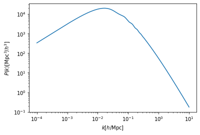
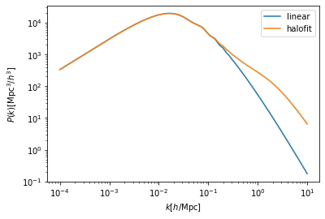

Pyhalofit example notebook
==========================

.. code:: ipython3

    import numpy as np
    import matplotlib.pyplot as plt
    import pyhalofit

.. code:: ipython3

    # loading precomputed power spectrum and cosmological parameters
    k, pklin = np.loadtxt('data/kpk.txt', unpack=True)
    cparam = dict(zip(['Omega_de0', 'Omega_K0', 'w0', 'wa', 'h'], np.loadtxt('data/cparam.txt')))
    z = np.loadtxt('data/z.txt')
    
    print('cparam   : ', cparam)
    print('redshift : ', z)
    
    plt.figure()
    plt.xlabel(r'$k[h/{\rm Mpc}]$')
    plt.ylabel(r'$P(k)[{\rm Mpc}^3/h^3]$')
    plt.loglog(k,pklin)
    plt.show()

.. parsed-literal::

    cparam   :  {'Omega_de0': 0.6844, 'Omega_K0': 0.0, 'w0': -1.0, 'wa': 0.0, 'h': 0.67}
    redshift :  0.251

Basic usage of pyhalofit
------------------------

.. code:: ipython3

    hf = pyhalofit.halofit() # make instance
    hf.set_cosmology(cparam) # input cosmological parameter with dict
    hf.set_pklin(k, pklin, z) # input k, power, and redshift
    pkhalo = hf.get_pkhalo() # obtain halofit

.. code:: ipython3

    plt.figure()
    plt.xlabel(r'$k[h/{\rm Mpc}]$')
    plt.ylabel(r'$P(k)[{\rm Mpc}^3/h^3]$')
    plt.loglog(k,pklin , label='linear')
    plt.loglog(k,pkhalo, label='halofit')
    plt.legend()
    plt.show()

Tips
----

.. code:: ipython3

    # obtain cosmological current paramter dict
    hf.get_cosmology()

.. parsed-literal::

    {'Omega_de0': 0.6844, 'Omega_K0': 0.0, 'w0': -1.0, 'wa': 0.0, 'h': 0.67}

